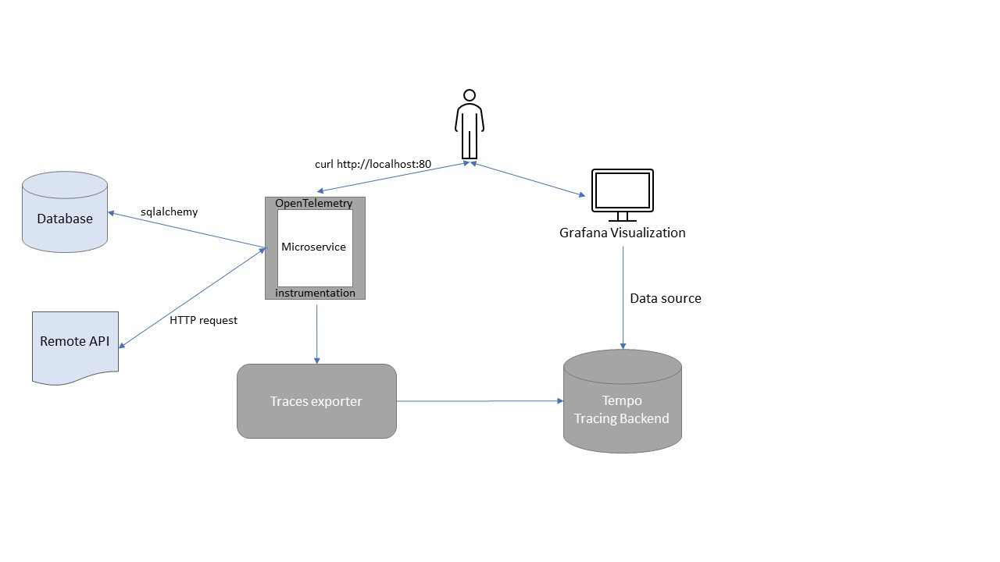

# Auto-instrumented Tracing with OpenTelemetry and Grafana
## Scope
In Cloud or microservice environments it's often hard to hunt down performance issues or bugs. Tracing can help following
the communication flow. OpenTelemetry provides the tools and methods to get tracing going, Tempo and Grafana are backend / 
visualization tools for gaining insights from tracing.

As adding tracing to all involved components and services can be a tough task, auto instrumentation is a feasible approach.

This demo includes an example microservice that calls an outside API and writes to a local database. Tracing is added
via auto instrumentation, traces are sent to Tempo (tracing backend) and can be explored via Grafana. This setup can be
considered representative for a microservice architecture.



## Build and run application
This demo setup is for local run. Dependencies:
* Ubuntu or other Linux (e.g. in WSL)
* Docker Engine, Docker Compose

checkout repo:
`git clone https://codehub.sva.de/Rene.Radoi/tracing_with_opentelemetry_grafana.git`

build image for web service locally:
`docker build -t world-countries:1.0 .`

run on your machine:
`docker-compose up -d`

generate requests - chose a country and run curl:
`while true; do curl http://0.0.0.0:80/world?country=Finland; sleep 2; done > /dev/null 2>&1`

## add auto instrumentation
no need to adjust the program code to add tracing

tracing exporter can be plugged in at startup: 
```
opentelemetry-instrument --traces_exporter otlp --metrics_exporter none --service_name world-countries --exporter_otlp_endpoint http://tempo:4317 uvicorn world_countries:app --host 0.0.0.0 --port 80
```
instead of
```
uvicorn world_countries:app --host 0.0.0.0 --port 80
```

## Grafana Explore
`http://localhost:3000` -> TraceQL Query: `{.http.status_code = 404}`

## Grafana Dashboard
`http://localhost:3000` -> Dashboards -> Tracing -> Tracing Metrics

## Deployment Scenario
In Kubernetes-based infrastructure environments it's a good idea to add instrumentation via the operator. Configuration
is then rolled out as custom resources, services and components can be auto-instrumented just by adding an annotation:
`instrumentation.opentelemetry.io/inject-python: "true"`

More information: https://github.com/open-telemetry/opentelemetry-operator

## Possible extensions
- integrate with logs (requires Loki)